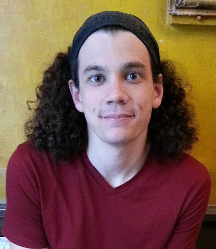
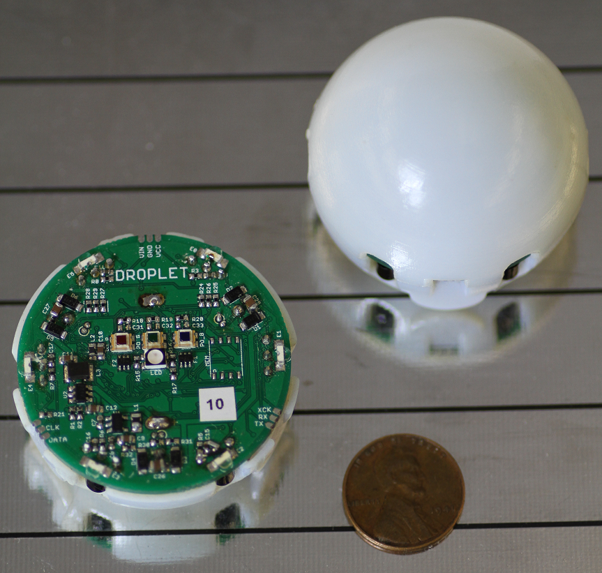
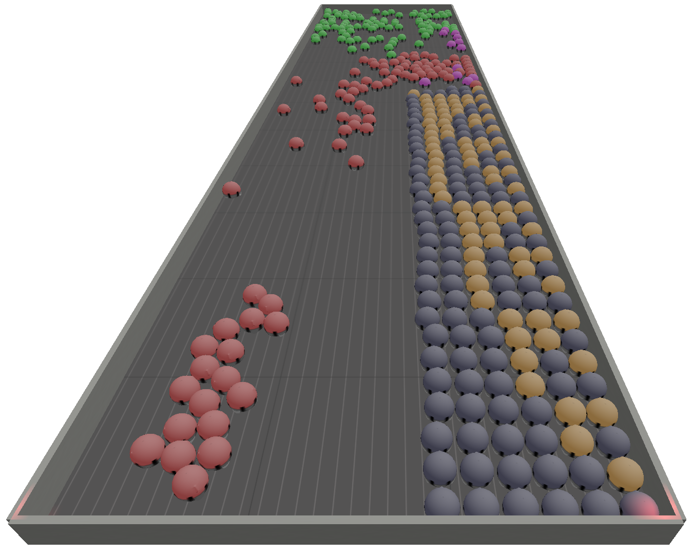

# Personal Information

## Name
John Klingner

## Email
john.klingner@Colorado.EDU

## Photo

## Website

# Current Funding
I have a Research Assistantship with CU Boulder.

# PhD Program

## Thesis Advisor
Dr. Correll

## Committee

## Milestones

| Milestone            | Completed         | Planned           |         
| -------------------- | ----------------- | ----------------- |
| Start                | Fall 2012         |                   |
| Area Exam            | ---               | Fall 2014         |
| Proposal Defense     | ---               | TBD               |
| Dissertation Defense | ---               | TBD               |

## Courses

| Course                                   | Taken          | Planned        | Depth   | Breadth | 
| ---------------------------------------- | -------------- | -------------- | ------- | ------- |
| ASEN 6519 Model-Based Param & State Est  | ---            | Spring 2015    | yes     | no      |
| CSCI 7000 Physical & Tangible Computing  | ---            | Spring 2015    | yes     | no      |
| CSCI 7000 Robotic Materials              | Fall 2014      | ---            | yes     | no      |
| CSCI 8990 Doctoral Dissertation          | Fall 2014      | ---            | no      | no      |
| CSCI 7900 Ind. Study w/ Dr. Correll      | Spring 2014    | ---            | yes     | no      |
| CSCI 5352 Network Analysis & Modeling    | Fall 2013      | ---            | no      | yes     |
| CSCI 5832 Natural Language Processing    | Fall 2013      | ---            | no      | yes     |
| CSCI 5446 Chaotic Dynamics               | Spring 2013    | ---            | no      | yes     |
| CSCI 5454 Design & Anlys of Algorithms   | Spring 2013    | ---            | no      | yes     |
| CSCI 7000 Automata Cyber Phys Systems    | Fall 2012      | ---            | no      | yes     |
| CSCI 7900 Ind. Study w/ Dr. Correll      | Fall 2012      | ---            | yes     | no      |
| CSCI 6000 Intro to PhD                   | Fall 2012      | ---            | no      | no      |

# Research

## Publications

* Distributed Robotic Self-Assembly using the DNA Tile Assembly Model by Ayan Dutta, John Klingner, Anshul Kanakia, and Nikolaus Correll. Pending review for ICRA 2015.
* A Response Threshold Sigmoid Function Model for Swarm Robot Collaboration by Anshul Kanakia, John Klingner, and Nikolaus Correll. To be published with the proceedings of DARS 2014.
* A Stick-Slip Omnidirectional Powertrain for Low-Cost Swarm Robotics: Mechanism, Calibration, and Control by John Klingner, Anshul Kanakia, Nicholas Farrow, Dustin Reishus, and Nikolaus Correll. Published with the proceedings of IROS 2014.
* Miniature Six-channel Range and Bearing System: Algorithm, Analysis, and Experimental Validation by Nicholas Farrow, John Klingner, Dustin Reishus, and Nikolaus Correll. Published with the proceedings of ICRA 2014.
* Sustainable multi-core architecture with on-chip wireless links by Jacob Murray, John Klingner, Partha P. Pande,  and  Behrooz Shirazi. Published with the proceedings of GLSVLSI 2012

## Presentations

* Presented "A Stick-Slip Omnidirectional Powertrain for Low-Cost Swarm Robotics" in Chicago in September 2014. [pdf](files/Presentation.pdf) note: videos will only play in Adobe Acrobat Reader
      
## Awards

* "A Response Threshold Sigmoid Function Model for Swarm Robot Collaboration" Best Paper Nominee at DARS 2014

# Teaching

* TA for CSCI 2400 Computer Systems, Spring 2014
* TA for CSCI 2400 Computer Systems, Fall 2013
* TA for CSCI 4308/4318 Software ENgineer Project 1/2, Fall 2012/Spring 2013

# Highlights

## 

